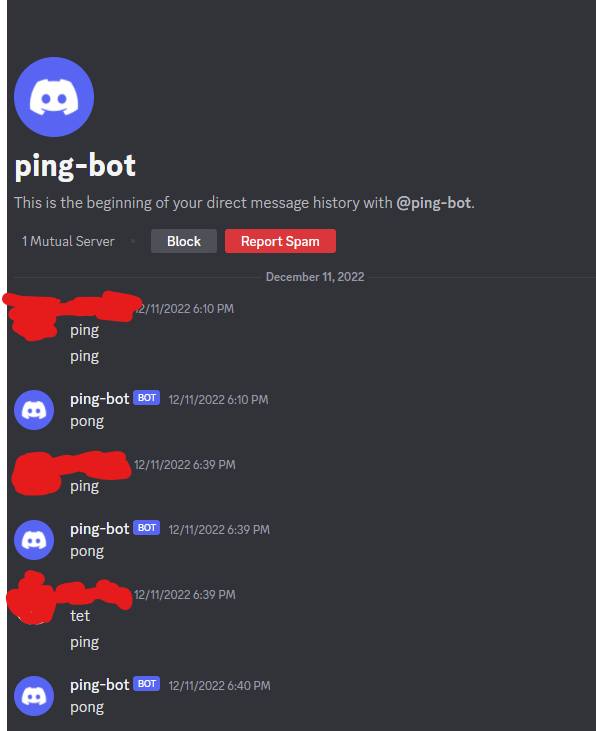

# GoLangDiscordPingBot

I created this Discord bot to practice using GoLang.

It's basic funaction is to respond to messages of ping with pong.
This can be a useful launch point to adding further fuctionality.

 

# Example of the Ping-Bot responding

 

Made with the help of <a href="https://github.com/bwmarrin/discordgo">DiscordGo</a>
